#eRace 

__Live Site:__
[eRace](https://erace-client.herokuapp.com/) 

## Project description 
As a runner, you become part of a global community. A running race brings together participants from all over the world, not only to compete with, but also to socialize and motivate each other.

eRace is a web browser application for where runners can find and inform each other of races worldwide. The database is provided by the community in two stages per race: First, one user provides a small set of basic facts (place, time, etc.). Second, any user may add additional facts in text or image form.

The application has been designed specifically with use on mobile devices in mind.

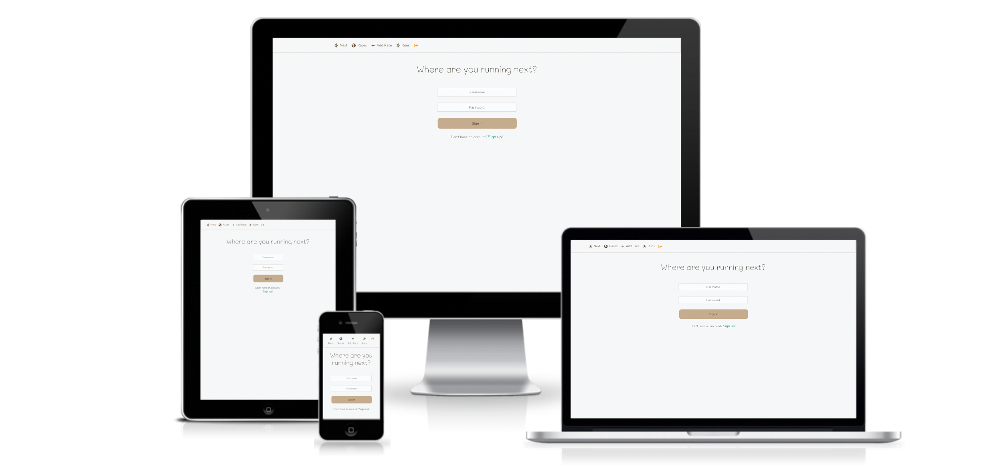

## Project Goals

Finding a race — Whether you are looking for a picturesque trail run near you, or going for a holiday and want to find a run in that specific country, you can find it by searching this crowd sourced repository.

Joining the buzz — Share your insights with your fellow users and gain new insights from them. 

Keeping a record — Your past races are displayed separately for easy access and ego boost.

Scheduling races to come — Your next upcoming race is always presented after sign in and a chronological list of all upcoming races is easily accessible.

## Features
### The Business Interface

#### __Sign In Page__
The login page is the first page a user will see. From here there are two ways to continue:
- Go to the sign up page to register a new account in order to sign in. 
- If already registered simply sign in to get access to the applications features. 

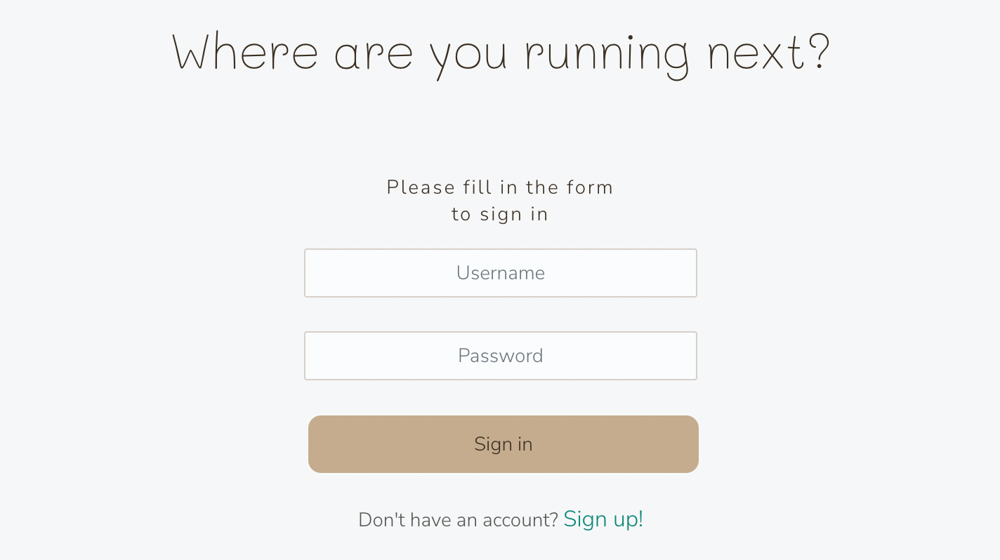
#### __Sign Up Page__
The sign up page is for new users where they fill in information to register a new account. After signing up, users will automatically be redirected to the login page. 

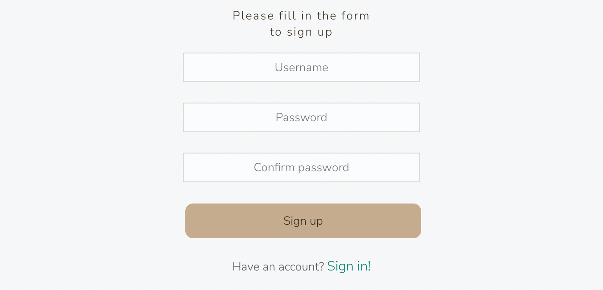

#### __"Next" Page__
Once logged in, this is the landing page. Here there are two different stages. 
- First time and before any races have been added to "my runs" a message will show with instructions. 
- After adding races to "my runs", the race closest in time will be displayed with a countdown of days, hours, minutes and seconds left  to the start of the race. 

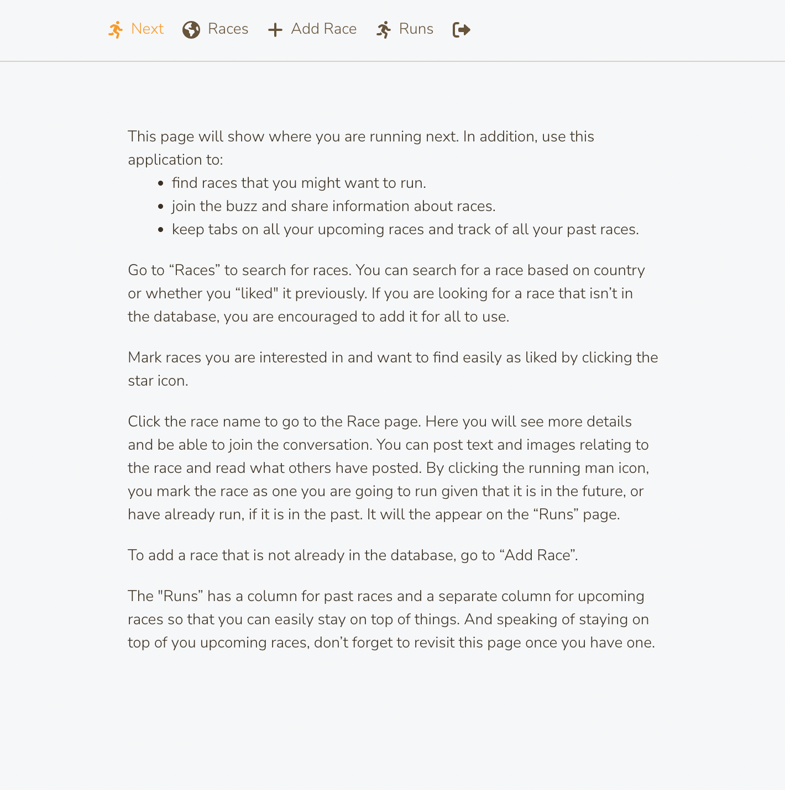

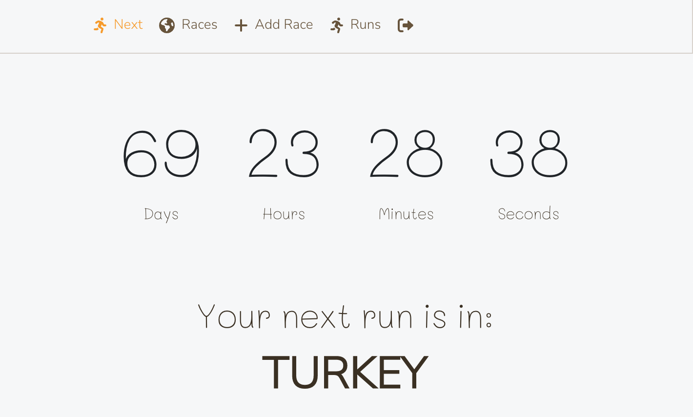

#### __Races Page__
The race page shows a list of all races added by users. 
- This list gives users a quick overview about each race with: 
Name of the race, distance, date and country. 
- From here, user are able to go to detail page of any of the listed races. 
- Users are able to like a race by clicking the star, it will then be easy to find later on.

There are three filter features users can choose from. 
- Users can search on a country. A dropdown list of countries will appear and make it easy for users to select the correct country. 
- Users can select "liked races" and only liked races will show in the list. 
- Users can select "upcoming races" and only upcoming races will show up in the list; passed races will not show.

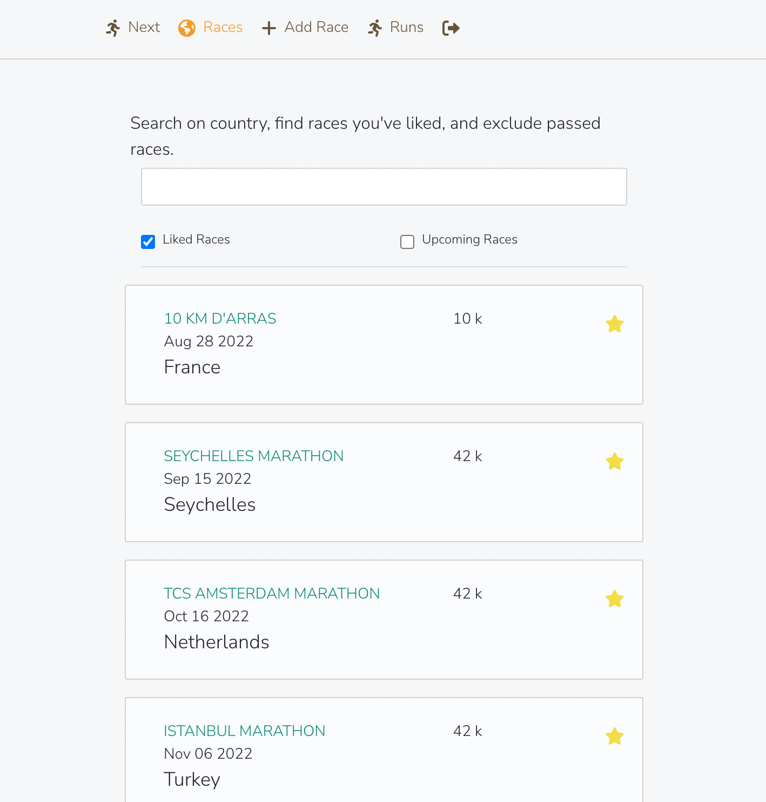

#### __Detail Page__
Users who want to read more about a specific race, can click the race name on the Races or My Runs page; the detail page then shows up.
- Additional basic information such as time and official website is showed. 
- The website is a clickable link for users to visit the official website and register for the race. 
- Users can mark that they are running the race and the race will be added to "My Runs".
- Users can leave comments, add updated information about the race and add images to inspire other runners. 
- The user who added the specific race can edit and update the basic information. 

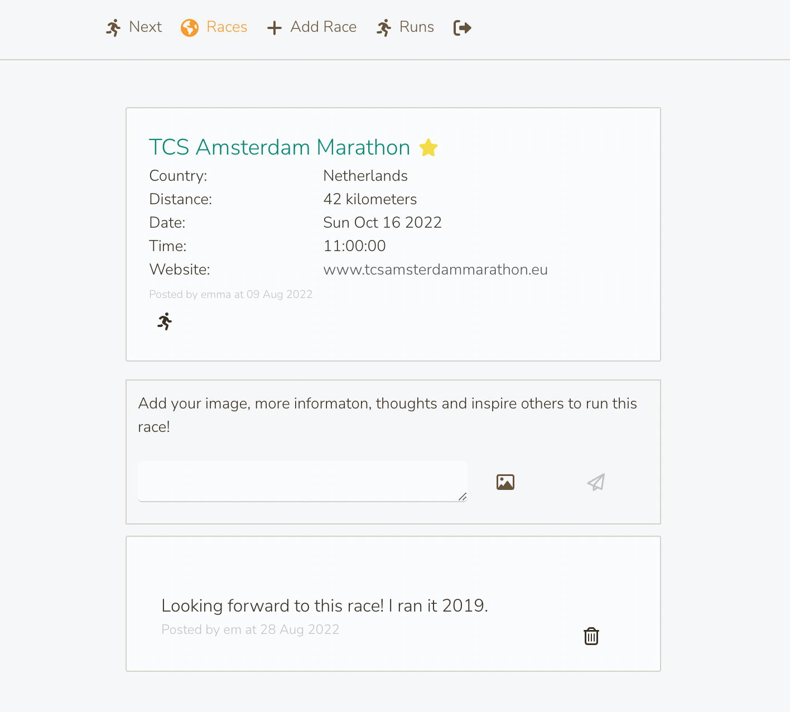

#### __Edit Race Page__
The Edit Race page is where the user who added the specific race can edit and update the basic information. The instructors on the page emphazise things that are important to think about when adding a race. 
- A user can click save or cancel and will be redirected to last visited detail page.

#### __Add Race Page__
The Add Race page is where users add races that are not already in the database. The instructors on the page emphazise things that are important to think about when adding a race. 
- A user can click create or cancel and will be redirected to latest visited page.

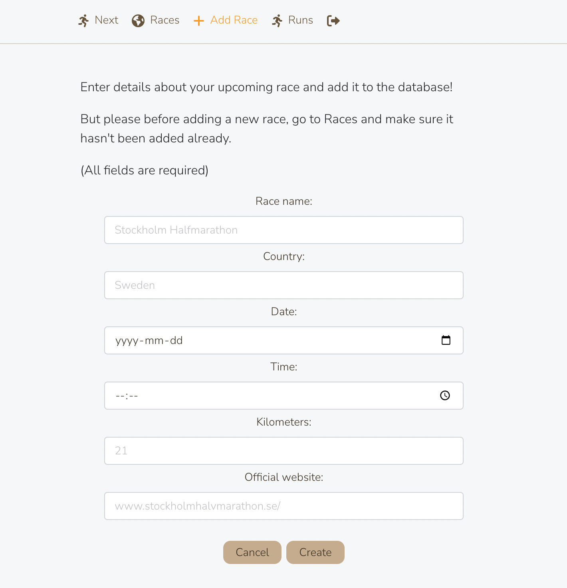

#### __My Runs Page__
This is the users personal page and for users to have a overview of passed and upcoming races. After marking races to run, the race will then be displayed on the My Runs Page. User can click the race name and the detail page then shows up.

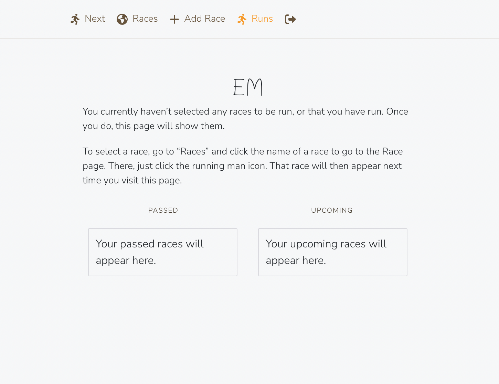

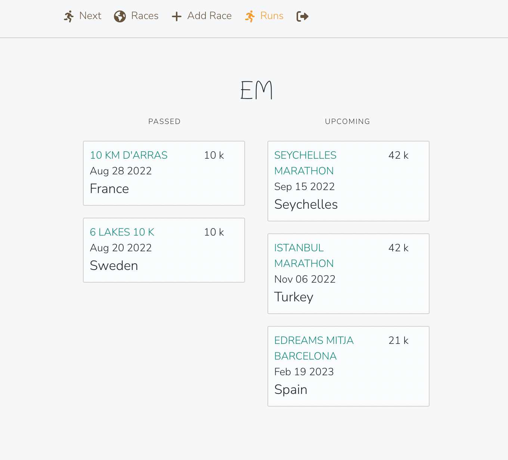

### Future Features
There are many ways to extend the capabilities of the service. For instance I would like to add: 
- Users can connect with other users 
- Users can edit and update thier accounts detail
- Users can see how many other people have liked and are running a race
- Show runs on map
- Show runs on timeline

## Project Plan 
I used [Git Project](https://github.com/users/EmmaBergner/projects/1) to plan and to follow up with my project. 

### User Stories

Directly related project goals (see above) are listed within brackets.

__Authentication__
- As a user I want to be able to sign up and to sign in with username and password so that I can access my account. [All project goals]
- As a user I should be logged in to access the site. [All project goals]

__Race__
- As a user I want to be able to add a race I’m interested in, I will attend or I want to recommend. [Joining the buzz]
- As a user I want to be able to edit the race I have added. [Joining the buzz]
- As a user I want to be able to search on a country to see upcoming races in that specific country. [Finding a race, Joining the buzz]

__Comment__
- As a user I want to be able to see all information about a race and add to it. [Joining the buzz]

__Like__
- As a user I want to be able to see the races I am interested in. [Finding a race]
- As a user I want to be able to mark races so that I can easily see the ones I’m interested in or will attend. [Finding a race]

__Run__
- As a user I want to be able to see my past and upcoming races. [Keeping a record, Scheduling races to come]
- As a user I want to be able to see details about my next upcoming race so that I get an extra push. [Scheduling races to come]

__Touch Up__
- As a user I want a friendly interface. [All project goals]

## Graphic Design  
__Color Scheme__

I wanted to keep the color scheme nice and clean for this project so I chose these colors (that work nicely together).
 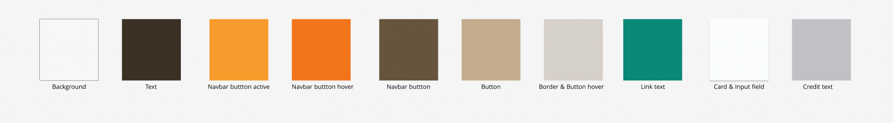

__Favicon__ 

The favicon was supplied from the webservice icons8. 
 

__Wireframes__

I created my wireframes and the design for my project using Figma. 
 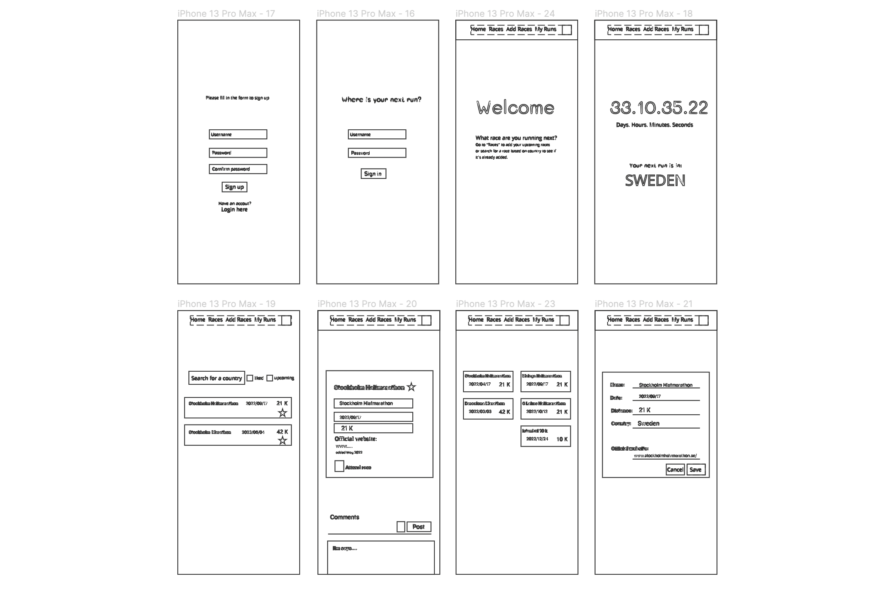

## Technologies Used
### Languages Used
- React 
- HTML 
- CSS
- Python 
- JavaScript (JSX)

## Frameworks, Libraries and Programmes Used
- __GitHub__
    was used to store the code for the project. 
- __GitPod__
    was used to some extent to provide the programming environment. 
-  __Visual Studio Code__ 
    was used for all coding.
-  __Heroku__ 
    is a cloud based application platform connected to GitHub, used to deploy this project.
- __React Bootstrap__
    is a component-based library where I made heavy use of the grid components (Container, Row and Col). This simplified implementing responsive layouts compared to using CSS only. I also used the Button and Form components to implement input although the gain over using pure HTML is less apparent.  
- __Google Fonts__
    was used to import the fonts Mali, Nunito Sans and Roboto as the fonts for this project.
- __Font Awesome__
    was used for the like, run, delete, image, edit and post icons.
- __Cloudinary:__ 
    was used to store images online.
- __Git Projects__
    was used for keeping track of user stories, tasks and to manage the project. 
- __Figma__
    is a graphic design tool and helped with the design for this project. 

## Implemented Components

The React architecture assumes implementation of reusable components. These are the components implmented in this projected and how they are used.

| Component | Purpose | Used in component |
|----|----|----|
| SignInUpForm | Let a user sign in or sign up | App |
| NavBar | Let user navigate to pages | App |
| HomePage | Display information about next upcomming race | App |
| CreateRace | Input a race | App |
| RaceListPage | Display all races in the database | App |
| RunsPage | Display user's runs | App |
| DetailRace | Display all basic information about a race | RaceDetailPage |
| CommentCreateForm | Input a comment (text and image) | RaceDetailPage |
| Comment | Display a comment (text and image) | RaceDetailPage |
| Asset | Display images, messages, or animations | HomePage RaceDetailPage RaceListPage RunsPage |
| ListRace | Display a summary of a race | RaceListPage RunsPage |
| RaceDetailPage | Display all information about a race and allow input | ListRace |

## Testing 
The final version was manualy tested by using each function on each page.

Sign up Page: 
- Verify that a new user can sign up. 
- Verify that an existing username can not be used.
- Verify that both password entered must match with each other. 
- Verify that the "sign in" link works. 

Sign in Page: 
- Verify that both correct sign in and incorrect sign in are handled. 
- Verify that the "sign up" link works.

Next Tab: 
- Verify that the instruction text is displayed when the user has no runs. 
- Verify that next upcoming race is displayed. 
- Verify that the remaining time is correct and continuosly updated.

Races Tab: 
- Verify that all races in the database are displayed if no filters are applied.
- Verify that filters work correctly.
- Verify that races are sorted by date ascending.
- Verify like and unlike. 
- Verify that race links to detail page. 

Detail Page: 
- Verify running and not running. 
- Verify all information is correctly displayed.
- Verify that the race can be edited by the owner only.
- Verify like and unlike.  
- Verify that comments (text and/or image) can be created. 
- Verify comments are corretly displayed. 
- Verify comments are sorted by date descending.
- Verify that comments can be deleted by the owner only. 

Edit Race Page:
- Verify that the instruction text is displayed. 
- Verify all information is correctly displayed.
- Verify that the user is notifed of empty fields.
- Verify that the race is modified correctly. 
- Verify that the cancel button works. 

Add Race Tab:
- Verify that the instruction text is displayed. 
- Verify that the user is notifed of empty fields.
- Verify that the race is created corretly. 
- Verify that the cancel button works. 

Runs Tab:
- Verify that the instruction text is displayed when the user has no runs.
- Verify that the logged in user's username is displayed. 
- Verify that passed runs are correctly displayed in descending order.
- Verify that upcoming runs are corretly displayed in ascending order. 
- Verify that races link to detail page.  

Sign Out Tab:
- Verify that the user's session ends. 
- Verify that the sign in page is displayed. 

Test were preformed using Chrome and FireFox. 

## Bugs Found
No known bugs. 

## Pre-Deployment Checklist
- Configured axios to use the deployed server api. 

## Deployment 
This project was deployed using Github and Heroku.

- Log in to Heroku.
- Create a "New App" and give it a name, it must be unique.
- Click "Create App" and this will take you to a page where you can deploy.
- Go to the deploy tab, select the repository of this README file, scroll down to the end and deploy the "main" branch.
- View the build log to make sure that everything works okay.
- The app has been deployed to Heroku.

## Credits

- Code Institude has through out the course provided me with various code solutions large and small that I have reused freely.  

- [W3School](https://www.w3schools.com/) helped me out with CSS code

- [Slackoverflow](https://stackoverflow.com/) helped me out with code solutions throughout the project

- [Getboostrap](https://getbootstrap.com/docs/4.1/layout/grid/) helped out with the layout components

- [Formatting](https://css-tricks.com/everything-you-need-to-know-about-date-in-javascript/) date methods